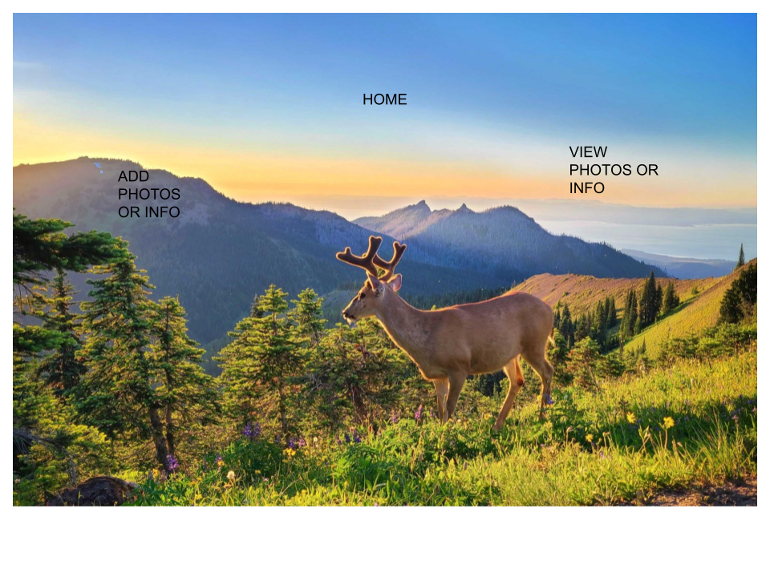
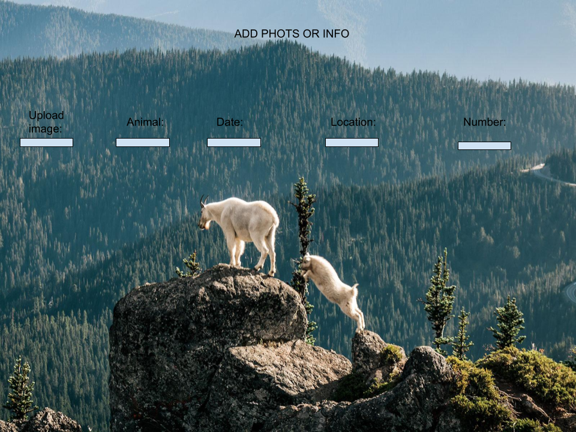
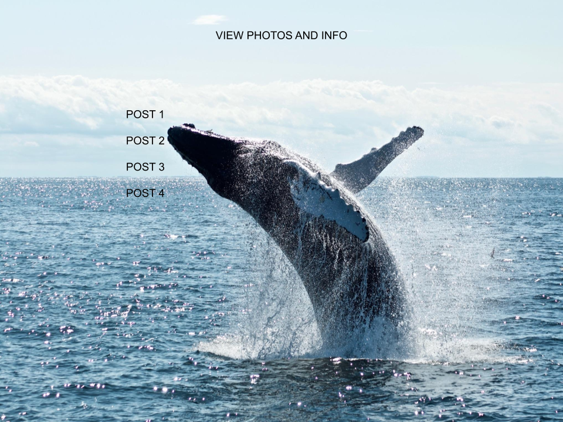
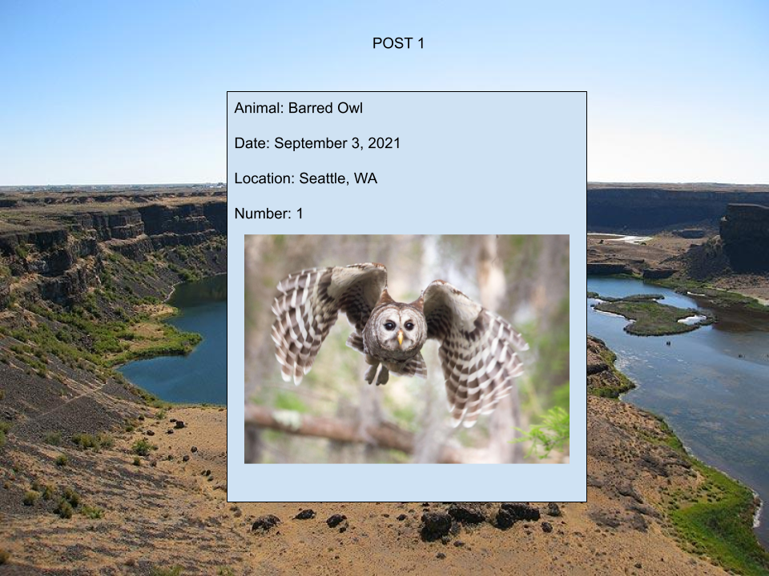
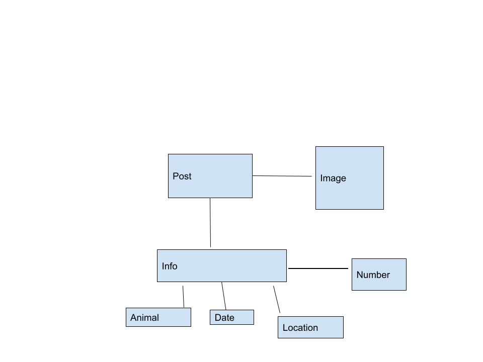

Elavator Pitch: 

For this project, I am making a website where people can upload information about their local wildlife that they have seen.  There will be a homepage with an "Add a Post" button and a "Show Existing Posts" button.  The info will be type of animal, date, number, and location.  The add button will allow people to add info.  The show button will allow people to view existing posts.  The show page will have links to each post and the post pages will have the info and photos visible.

Technologies Used: 

CSS, JavaScript, Express, Mongoose, MongoDB, EJS

Installation Steps:

Install Node, Mongoose, MongoDB, Express, EJS, Rowdy-Logger, and Method-Override, then run nodemon in the terminal and go to the local host with the correct port number in the browser.

User Stories:

The user will be any typical person who is interested in animals and has seen an animal recently.  They start at the homepage.  If they click the add button, they will be taken to a page where they can upload info about wildlife such as type of animal, number seen, date seen, and location.   Their additions will be added as a new post.  If they click the show button, they will be taken to a page where they can view all the previous info that has been uploaded.  From the list, they can view a post, edit a post, or delete a post.

Wireframe:

ERD:

Unsolved Problems/Future Features:

I wanted to use Upload Care to allow the user to upload photos of animals, but I ran out of time.  I also want to add authentication in the future.  Also, I ran out of time to get my buttons on my homepage to link to the correct pages.